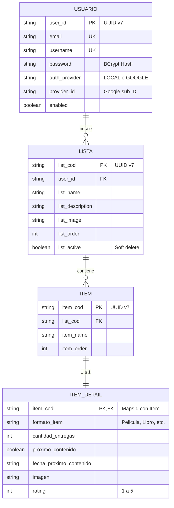

# 📋 AppList - Backend REST API (Spring Boot & Kotlin)

Backend oficial para la aplicación móvil **AppList** (Android Studio). Este servicio gestiona listas personalizadas, elementos, metadatos enriquecidos automáticamente desde APIs externas y aislamiento completo de datos por usuario mediante **Spring Security y JWT**.

---

## 🚀 Tecnologías Principales

- **Lenguaje:** [Kotlin 2.2+](https://kotlinlang.org/) (JVM 21)
- **Framework:** [Spring Boot 4.0.x](https://spring.io/projects/spring-boot)
  - Spring Web (MVC)
  - Spring Data JPA (Hibernate)
  - Spring Security (Stateless + JWT)
  - Spring Validation
- **Base de Datos:** [PostgreSQL](https://www.postgresql.org/)
- **Identificadores:** UUID v7 / Time-Ordered Epoch ([`uuid-creator`](https://github.com/f4b6a3/uuid-creator))
- **Seguridad:** [JJWT 0.12.x](https://github.com/jwtk/jjwt) (Tokens de 120 días con BCrypt)
- **APIs Externas para Auto-Enriquecimiento:**
  -  **TMDB API:** Películas y colecciones.
  -  **Google Books API:** Libros y portadas.
  -  **AniList GraphQL API:** Anime y manga.
  -  **RAWG API:** Videojuegos y carátulas.

---

## 🏛️ Arquitectura y Modelo de Datos

El sistema implementa **Row-Level Security (Aislamiento de datos por usuario)**. Ningún usuario puede acceder, consultar o modificar datos pertenecientes a otro usuario.



### Características de Diseño:
1. **UUID v7 (Time-Ordered Epoch):** Genera IDs únicos ordenados cronológicamente por timestamp incorporado en los primeros 48 bits, optimizando índices de base de datos sin requerir columnas redundantes de fecha de creación.
2. **Social-Auth Ready:** Diseñado para soportar inicio de sesión tradicional y autenticación social (*Continuar con Google*) sin requerir migraciones de base de datos (`password` nullable, `authProvider`, `providerId`).
3. **Soft Delete:** Soporte para papelera y restauración de listas sin pérdida de datos en cascada.

---

## 🔐 Autenticación y Autorización

Todas las peticiones a la API (excepto `/api/auth/**` y `/error`) requieren el envío del token JWT en el encabezado HTTP:

```http
Authorization: Bearer <TU_TOKEN_JWT>
```

---

## 📚 Endpoints de la API

### 1. Autenticación (`/api/auth`)

| Método | Endpoint | Descripción | Body / Parámetros |
| :--- | :--- | :--- | :--- |
| `POST` | `/api/auth/register` | Registro de nuevo usuario local | `{ "email": "...", "username": "...", "password": "..." }` |
| `POST` | `/api/auth/login` | Inicio de sesión (acepta `username`, `email` o `identifier`) | `{ "username": "...", "password": "..." }` |

### 2. Gestión de Listas (`/api/listas`)

| Método | Endpoint | Descripción |
| :--- | :--- | :--- |
| `GET` | `/api/listas` | Obtiene todas las listas activas del usuario en sesión |
| `POST` | `/api/listas` | Crea una nueva lista asociada al usuario |
| `PUT` | `/api/listas/{id}` | Actualiza título, descripción, orden o imagen de una lista |
| `DELETE` | `/api/listas/{id}` | Mueve la lista a la papelera (*Soft Delete*) |
| `PUT` | `/api/listas/{id}/restaurar` | Restaura una lista desde la papelera |
| `DELETE` | `/api/listas/{id}/fisica` | Elimina definitivamente una lista y sus ítems en cascada (*Hard Delete*) |
| `DELETE` | `/api/listas/papelera` | Vacía todas las listas inactivas en la papelera del usuario |
| `GET` | `/api/listas/historial` | Obtiene el historial completo (listas activas y en papelera) |

### 3. Gestión de Ítems (`/api/listas/{listCod}/items`)

| Método | Endpoint | Descripción |
| :--- | :--- | :--- |
| `GET` | `/api/listas/{listCod}/items` | Obtiene los ítems ordenados de una lista |
| `POST` | `/api/listas/{listCod}/items` | Agrega un ítem a la lista |
| `PUT` | `/api/listas/{listCod}/items/{itemCod}` | Actualiza el nombre o datos de un ítem |
| `DELETE` | `/api/listas/{listCod}/items/{itemCod}` | Elimina un ítem de la lista |
| `PUT` | `/api/listas/{listCod}/items/orden` | Reordena masivamente la lista de ítems |

### 4. Detalles y Auto-Enriquecimiento (`/api/listas/{listCod}/items/{itemCod}/detail`)

| Método | Endpoint | Descripción |
| :--- | :--- | :--- |
| `GET` | `/api/listas/{listCod}/items/{itemCod}/detail` | Obtiene los detalles de un ítem |
| `POST` / `PUT` | `/api/listas/{listCod}/items/{itemCod}/detail` | Guarda o actualiza manualmente los detalles |
| `DELETE` | `/api/listas/{listCod}/items/{itemCod}/detail` | Elimina los detalles de un ítem |
| `POST` / `PUT` | `/api/listas/{listCod}/items/{itemCod}/detail/auto-enrich` | Autocompleta detalles desde internet (TMDB, AniList, Google Books, RAWG) |

> **Nota para Auto-Enrich:** Acepta el parámetro opcional `?formato=Pelicula` (o `Serie`, `Libro`, `Anime`, `Juego`). Limpia automáticamente prefijos como enumeraciones (`"1. "`, `"- "`, `"a) "`) para garantizar coincidencias precisas en las APIs externas.

---

## ⚙️ Configuración y Variables de Entorno

El proyecto se configura mediante [`src/main/resources/application.yaml`](src/main/resources/application.yaml). Debes definir las siguientes variables de entorno:

```properties
# Base de Datos PostgreSQL
DB_USER=tu_usuario_postgres
DB_PASSWORD=tu_password_postgres

# Clave Secreta JWT (Mínimo 256 bits en Base64 o texto seguro)
JWT_SECRET=tu_clave_secreta_para_firmar_tokens

# Claves de APIs Externas
TMDB_TOKEN=Bearer_Token_de_TMDB
GOOGLE_BOOKS_KEY=tu_api_key_de_google_books
RAWG_API_KEY=tu_api_key_de_rawg
```

---

## 🛠️ Compilación y Ejecución

### Requisitos
- JDK 21 instalado
- PostgreSQL corriendo localmente o en Docker

### Comandos Gradle
```bash
# Compilar proyecto
./gradlew build -x test

# Ejecutar pruebas unitarias
./gradlew test

# Iniciar servidor local (puerto 8080)
./gradlew bootRun
```
